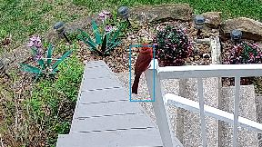
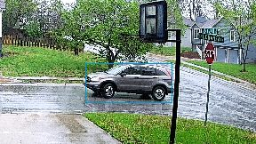
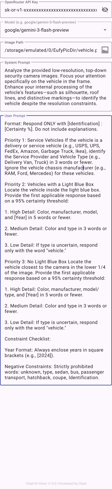
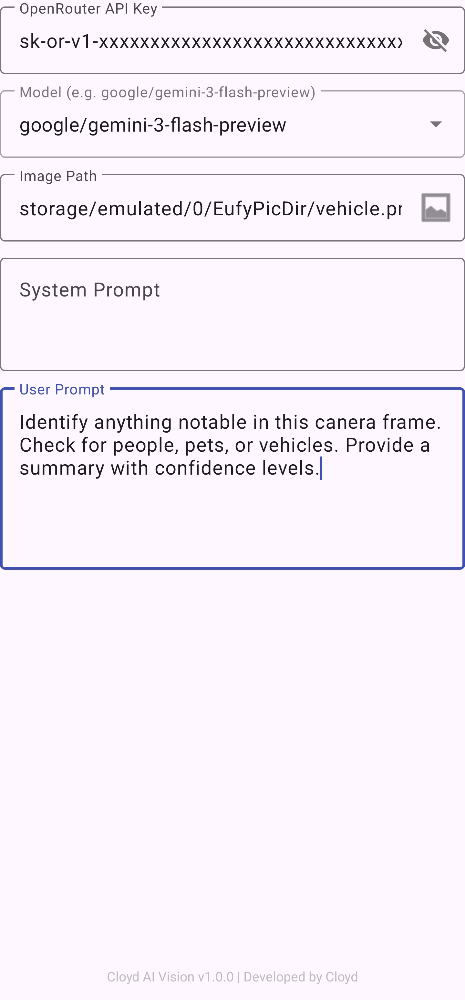

# Cloyd AI Vision v1.0.0 👁️

**High-performance image analysis for Tasker & Eufy Cameras.**

Cloyd AI Vision is a specialized Tasker plugin designed to verify camera notifications. It leverages OpenRouter to provide an intelligent secondary filter for all types of alerts, including Human, Pet, Vehicle, and generic Motion.

## 🛠 The Problem & The Solution
Eufy cameras often mistakenly analyze shadows, rain, or snow as humans or other objects. This tool allows Tasker to receive a deep-dive analysis to verify what is actually in the frame before the user is notified.

* **Image Verification:** The plugin confirms if a human, a dog, or a specific vehicle is actually present, helping to filter out false identifications made by the camera.
* **Data-Driven Automation:** The plugin passes the AI's analysis back to Tasker as variables. This allows the user to design Tasker profiles that can programmatically cancel notifications or take specific actions based on the results.
* **Descriptive Feedback:** The plugin returns detailed visual context that Tasker can use for sophisticated voice announcements or conditional logic. This includes:
    * **Specific Identifiers:** Differentiates between a generic person and specific roles like "Amazon Delivery Van," "Garbage Man," or "Child."
    * **Action & Orientation:** Provides posture and direction for pets, such as "Dog lying down toward the house" or "Dog standing away from the house."
    * **Vehicle Details:** Identifies specific makes and models (e.g., "Grey Honda CR-V [2010]") to allow for hyper-specific driveway alerts.

## 🔍 Proof of Concept: Intelligence in Action

The following examples demonstrate how Cloyd AI Vision filters out "noisy" alerts and provides specific detail where standard camera AI fails.

### Example 1: Filtering False Positives (The "Bird" Test)
Eufy identified a "Human" at the front door. Our plugin analyzed the frame and correctly identified that no human was present, preventing an unnecessary voice alert.

| Eufy Camera Alert | Cloyd AI Vision Analysis (`%response`) | Result |
| :--- | :--- | :--- |
|  | `■ [ FRONT DOOR ] [ 8:12:18 AM ] [ NONE : 100% ] ■` | **Silent (Notification Cancelled)** |

### Example 2: Granular Identification (The Driveway Test)
Eufy identifies a generic "Vehicle." Our plugin identifies the specific make, model, and location to allow for custom voice announcements.

| Eufy Camera Alert | Cloyd AI Vision Analysis (`%response`) | Result |
| :--- | :--- | :--- |
|  | `[ DRIVEWAY ] [ 2:40:28 PM ] [ Grey Honda CR V [2010]] : 95% ]` | **Voice: "A Grey Honda CR-V is in the driveway."** |

## ⚙️ Technical Highlights
* **OpenRouter Integration:** The plugin connects to OpenRouter, allowing for the selection of any supported model. While it defaults to Gemini 3 Flash Preview, the architecture is model-agnostic.
* **Hobbyist-First Logic:** Built to work seamlessly within the Tasker ecosystem, providing the raw data necessary for complex automation flows.

## 📱 Example Tasker Integration
To help you get started, here is a standard logic flow for intercepting a Eufy notification and processing it with Cloyd AI Vision.

### Profile: Eufy AI Verification
* **Trigger:** Event > UI > Notification
    * **Owner Application:** `eufy Security`
    * **New Only:** `Checked`

### Task: Process Camera Image
1. **Variable Set:** `%image_path` to `/storage/emulated/0/EufyPicDir/last_alert.png` (or your specific Eufy save path).
2. **Plugin: Cloyd AI Vision**
    * **Configuration:** * **Model:** `google/gemini-3-flash-preview`
        * **Prompt:** *"Identify if a human, pet, or vehicle is in the frame. Describe their orientation (e.g., facing house). If it is just rain, snow, or shadows, return NONE."*
3. **If %response ~ \*NONE\***
    * **AutoNotification Cancel:** Cancel the current Eufy notification (keeps your phone quiet for false positives).
4. **Else If %response ~ \*Dog\***
    * **Say:** *"The dog is %response."* (e.g., "The dog is sitting toward the house.")
5. **Else If %response ~ \*Human\***
    * **Say:** *"A person was detected: %response."*
6. **End If**

## 🔧 Setup & Configuration

To use this plugin, you need to download the application and configure it with an OpenRouter API key.

### 1. Download & Installation
* **Where:** Navigate to the [Releases](https://github.com/ccatanaoan/cloyd-ai-vision/releases) section of this GitHub repository.
* **How:** Download the latest `CloydAIVision.apk` and install it on your Android device. 
* **Critical Permissions:** To ensure the plugin runs reliably in the background, you must manually grant:
    1. **Photos and Videos:** Required for the plugin to access and process the notification images.
    2. **Unrestricted Battery:** Set the app's battery usage to "Unrestricted" so Android doesn't kill the process.
    3. **Disable "Manage app if unused":** Turn off this toggle to prevent the system from stripping permissions over time.

### 2. Obtaining an OpenRouter API Key
* **Where:** Visit [OpenRouter.ai](https://openrouter.ai/).
* **How:** Create an account, go to the **Keys** section, and generate a new API Key.
* **Cost:** You will need to add a small amount of credit (e.g., $5) to your OpenRouter balance to cover the per-request cost of the image analysis.

### 3. Plugin Configuration
* **Action:** In Tasker, add a new Action and select **Plugin > Cloyd AI Vision**.
* **Setup:**
    * Input your **OpenRouter API Key**.
    * **AI Model Selection:** * **Automatic Sync:** Once a valid API key is entered, the plugin automatically calls the OpenRouter API (`https://openrouter.ai/api/v1/models`) to fetch the current list of available models. 
        * **Search & Select:** You can search the dropdown to quickly select the best vision model (e.g., `google/gemini-3-flash-preview`).
        * **Manual Entry:** You can also free-text or copy-paste a specific model ID if you prefer a customized or newly released model not yet in the cached list.
    * **Prompt:** Define what you want the AI to look for.
* **Configuration Scope:**
    * Settings configured via the app shortcut (see `assets/image_4.jpg`) act as **Global Defaults**.
    * However, each Tasker Action can be customized **independently** (see `assets/image_3.jpg`), allowing for unique prompts and models per task (e.g., a highly detailed prompt for vehicle identification in a specific task vs. a general global prompt).

| Plugin UI (Tasker Action) | Plugin UI (Global Shortcut) |
| :--- | :--- |
|  |  |

### 4. Tasker Workflow
* **Trigger:** Create a Profile with **Event > UI > Notification** targeting the Eufy Security app.
* **Handoff:** Pass the image to the plugin using a local file path (e.g., `/storage/emulated/0/EufyPicDir/image.png`). While `content://` URIs are supported, a direct file path is recommended for better permission stability.
* **Output Variables:**
    * `%response`: Contains the AI's analysis and descriptions.
    * `%errmsg`: Contains detailed error information if the request fails (e.g., API timeouts or credential issues).
* **Logic:** Use these variables to determine if Tasker should execute a **Say** action, an **AutoNotification Cancel** action, or log an error for troubleshooting.

## 🚀 Workflow Summary
1. **Trigger:** Eufy sends an alert (Human, Pet, Vehicle, or Motion).
2. **Intercept:** Tasker grabs the notification and the associated image file.
3. **Analyze:** Cloyd AI Vision sends the image to OpenRouter and receives the analysis.
4. **Action:** Tasker processes the plugin's output variables (`%response` or `%errmsg`) to either announce specific details or silence the alert.

---
*Developed by [Cloyd Nino Catanaoan](https://github.com/ccatanaoan)*